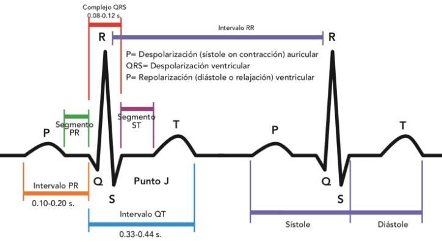
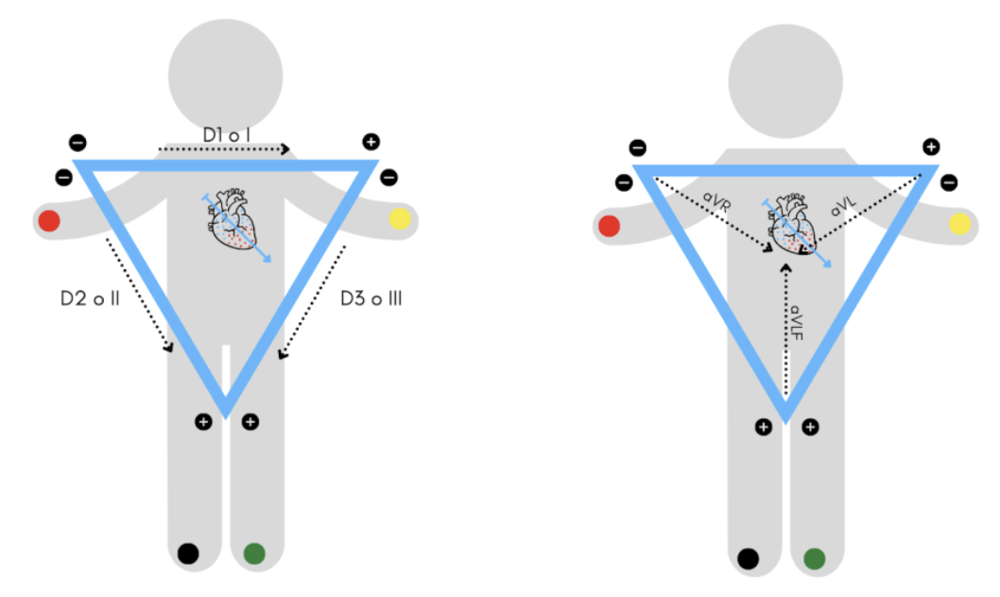

# LABORATORIO 5: Uso de Bitalino para ECG

## **Tabla de contenidos:**

1. [**Introducción**](#1-introducción)  
2. [**Objetivos**](#2-objetivos)
3. [**Materiales y equipos**](#3-materiales-y-equipos)
4. [**Procedimiento**](#4-procedimiento)
5. [**Resultados**](#5-resultados)
6. [**Conclusiones**](#6-conclusiones)
7. [**Referencias**](#7-referencias)

<!--  El uso del Padding es para controlar el espacio entre contenido y borde -->
 

## **1) Introducción** 

El uso de sistemas de adquisición de señales es ampliamente utilizado para la monitorización y el análisis de diversas señales fisiológicas. El electrocardiograma (ECG) es una herramienta utilizada para registrar la actividad eléctrica del corazón, participa en el diagnóstico de trastornos cardíacos como arritmias, infartos y enfermedades relacionadas. Estas enfermedades pueden identificarse analizando las distintas ondas que posee un ECG: la onda P, que refleja la despolarización de las aurículas; el complejo QRS, que indica la despolarización de los ventrículos, y la onda T, que representa la repolarización ventricular. Las variaciones en estas ondas pueden indicar diversas condiciones del corazón. Por ejemplo, un complejo QRS más ancho de lo esperado puede ser indicativo de un engrosamiento ventricular, lo cual es común en enfermedades como la hipertrofia ventricular [1]. 

  

  **Figura 1: Electrocardiograma con sus ondas e intervalos**
  

 

La monitorización de esta señal es posible mediante dispositivos portátiles como el Bitalino, un sistema flexible y accesible que permite la captura de diferentes señales biomédicas [2]. El dispositivo Bitalino, es una plataforma accesible para capturar señales biomédicas, incluyendo el ECG. A través del Bitalino, es posible obtener representaciones gráficas detalladas de las ondas cardíacas, lo que facilita la monitorización de la salud cardiovascular en tiempo real [3].

El ECG se obtiene utilizando derivadas específicas que permiten observar la señal desde diferentes ángulos. Las derivadas bipolares (como DI, DII, DIII) ofrecen vistas del corazón desde el plano frontal, mientras que las derivadas precordiales (como V1 a V6) proporcionan una visión más detallada desde el plano horizontal. Las derivadas unipolares (como aVR, aVL, aVF) permiten una mayor sensibilidad en el análisis de la actividad eléctrica del corazón [4].

 

   

**Figura 2: Derivaciones del ECG**  

 
## **3) Materiales y métodos** 
#Materiales

 
## **5) Resultados** 

| Foto  | Descripción |
|-------|------------|
|<image src="https://github.com/user-attachments/assets/89595d2a-77b8-4f45-b09f-4f5b0770f754" width="1500px" height="270px">|**Señal ECG:** 
 Las ondas P, QRS y T son claramente visibles en todas las derivaciones (I, II, III).La frecuencia cardíaca promedio oscila entre 65.5 y 70.6 bpm, dentro del rango normal (60-90 bpm) [A].No se observan alteraciones evidentes en la conducción eléctrica o en el ritmo cardíaco.
**Dominio de la Frecuencia:**
El contenido de energía del ECG se concentra aproximadamente entre 0.5 y 50 Hz, lo cual es fisiológicamente normal para las señales de ECG en reposo.Se detecta algo de ruido, el cual es típicamente producto del ambiente de laboratorio o de artefactos menores debido al movimiento.
 **Observaciones Importantes:**
El ruido eléctrico fue filtrado efectivamente.Se destaca la calidad de adquisición, aunque se pueden observar artefactos menores de movimiento en algunas de las derivaciones.
|
|<image src="https://github.com/user-attachments/assets/43b714cd-564b-44d9-81b4-417a36accca7" width="1500px" height="270px">|**Apnea de 10 segundos:** 
 Inhalación profunda: Se observa una disminución en el intervalo RR, lo que indica un aumento en la frecuencia cardíaca.Durante la apnea (mantener la respiración): Los intervalos RR se estabilizan, indicando que la frecuencia cardíaca se mantiene constante.

Exhalación: Se observa un aumento en el intervalo RR, lo que refleja una disminución en la frecuencia cardíaca [B].

Este patrón refleja arritmia sinusal respiratoria, un fenómeno fisiológico normal donde la frecuencia cardíaca varía con la respiración [B]
**Respiración cíclica (5s inhalación / 5s exhalación):**
 Durante la inhalación: Se observa un acortamiento en el intervalo RR, lo que corresponde a un aumento en la frecuencia cardíaca.

Durante la exhalación: Se observa una elongación del intervalo RR, lo que indica una disminución en la frecuencia cardíaca.

Este comportamiento sugiere un funcionamiento normal del sistema nervioso autónomo.
|

## **7) Referencias**

1. Johns Hopkins Medicine. Electrocardiogram. Available from: https://www.hopkinsmedicine.org/health/treatment-tests-and-therapies/electrocardiogram
2. Monroy JP, Silva H, Alves AP, Fred AL. BITalino: A low-cost, open-source bio-signal acquisition platform. Int J Biomed Eng Technol. 2017;24(4):324-336. Available from: https://www.researchgate.net/publication/236131119_BITalino_A_Biosignal_Acquisition_System_based_on_Arduino
3. PLUX – Wireless Biosignals. BITalino: A low-cost, open-source biosignal acquisition platform. Available from: https://www.pluxbiosignals.com/pages/bitalino​
4. Wasimuddin M, Elleithy K, Abuzneid S, et al. Stages-based ECG signal analysis: From traditional signal processing to machine learning approaches: A survey. 2020. Available from: https://www.researchgate.net/publication/346065771_Stages-Based_ECG_Signal_Analysis_From_Traditional_Signal_Processing_to_Machine_Learning_Approaches_A_Survey​

